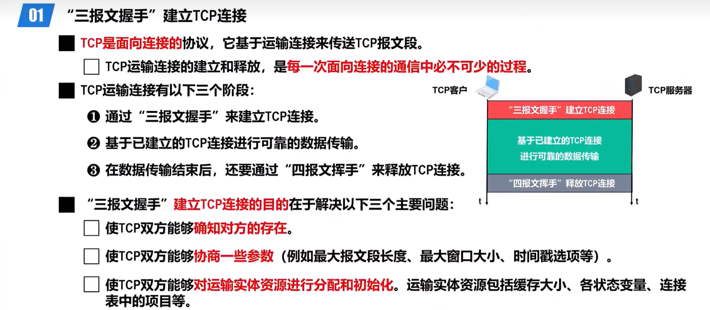
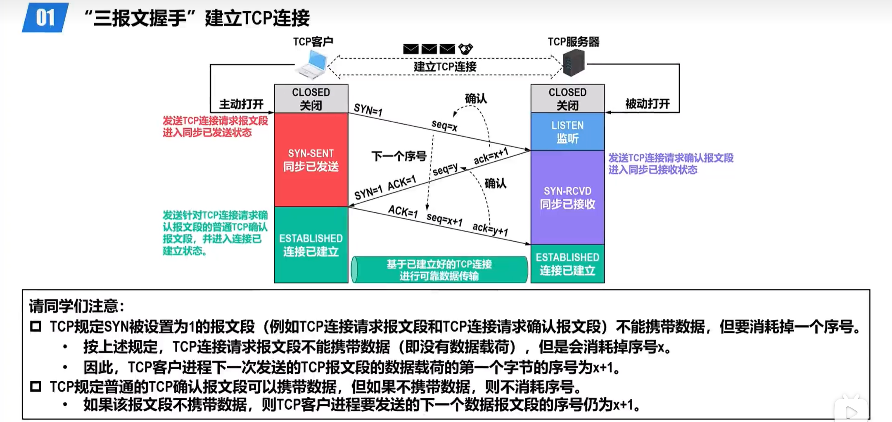
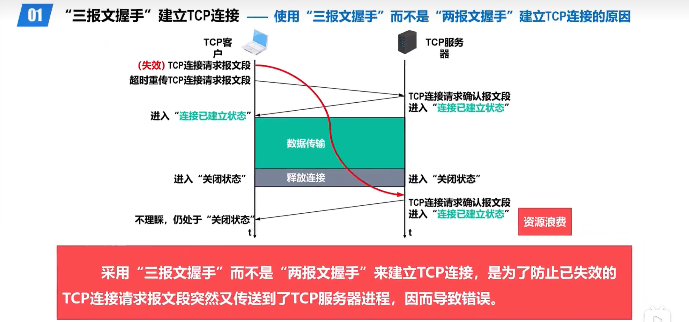
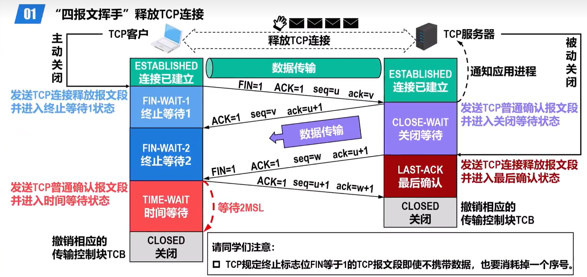
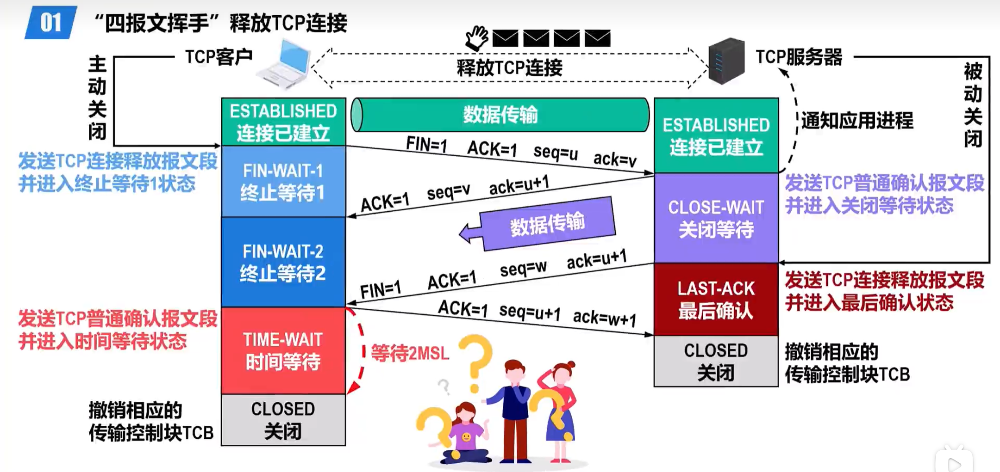
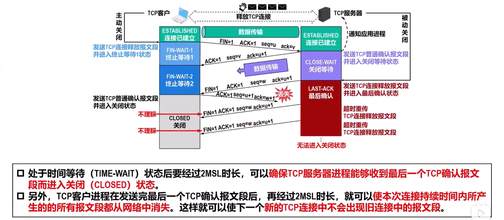
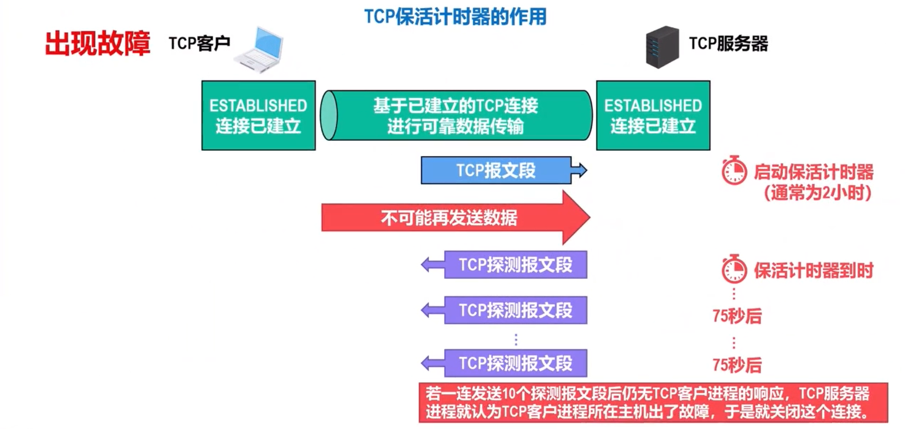
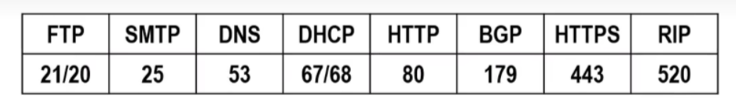

## Day32_Tuesday_Week6_3.31

1. **TCP连接的建立与释放** -- gzh

   ### 5.3.2 TCP的运输连接管理

   ------

   #### 5.3.2.(1)TCP的连接建立

   

   

   

   ------

   #### 5.3.2.(2)"四报文挥手"释放TCP连接

   

   

   

   

2. **IP首部协议字段值** -- gzh

   

3. **各应用程序的运输层端口号** -- gzh

   

4. **标题** -- ywj

   

5. **设置线程的属性** -- lw

   **一、设置线程属性核心思路**

   1. 先定义属性变量：`pthread_attr_t attr;`
   2. 初始化：`pthread_attr_init(&attr);`
   3. 设置各种属性（detach、stack、sched 等）
   4. 创建线程时传入 `&attr`
   5. 销毁属性：`pthread_attr_destroy(&attr);`

   ------

   **二、常用属性（按使用频率排序）**

   **1. 分离状态（最常用）**

   控制线程是否需要 `pthread_join` 等待回收。

   ```c
   // 设置为分离线程（自动释放，无需 join）
   pthread_attr_setdetachstate(&attr, PTHREAD_CREATE_DETACHED);
   
   // 默认：可接合线程（需要 join）
   pthread_attr_setdetachstate(&attr, PTHREAD_CREATE_JOINABLE);
   ```

   **2. 线程栈大小**

   防止递归 / 大数组导致栈溢出。

   ```c
   size_t stack_size = 1024 * 1024 * 8;  // 8MB
   pthread_attr_setstacksize(&attr, stack_size);
   ```

   **3. 调度策略（实时线程用）**

   - `SCHED_OTHER`：默认普通调度
   - `SCHED_FIFO`：实时先进先出
   - `SCHED_RR`：实时轮转

   ```c
   pthread_attr_setschedpolicy(&attr, SCHED_RR);
   ```

   **4. 线程优先级**

   配合实时调度使用，需要 root。

   ```c
   struct sched_param param;
   param.sched_priority = 10;  // 1~99，越大优先级越高
   pthread_attr_setschedparam(&attr, &param);
   ```

   **5. 继承调度策略**

   默认是继承创建者的优先级，想自己设置要关掉：

   ```c
   pthread_attr_setinheritsched(&attr, PTHREAD_EXPLICIT_SCHED);
   ```

   **6. 栈警戒区大小（防溢出）**

   ```c
   size_t guard_size = 1024 * 4;
   pthread_attr_setguardsize(&attr, guard_size);
   ```

6. **标题** -- lzw
